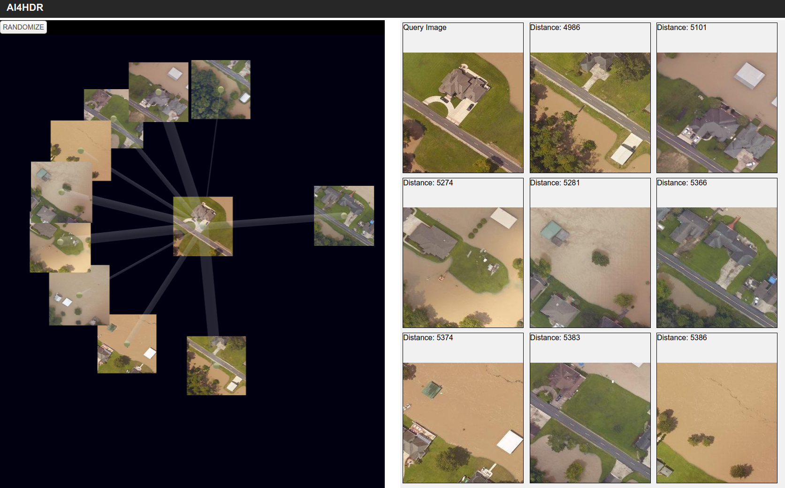

## Artificial Intelligence for Humanitarian Disaster Response - Image Retrieval
This project is a prototype application based on research done during a term at Oak Ridge National Laboratory with the Science Undergraduate Laboratory Internships (SULI) program. The goal of the project was to explore ways in which AI techniques could be used to aid first responders in the task of damage assessment after a natural disaster using aeriel imagery. 

The prototype, located in the "query-system-prototype" directory, is an image storage and content-based retieval system. An interactive 3D network visualization consisting of nodes and edges is used as the main query mechanism. Nodes in the network represent images in the database while edges represent query relationships. Users are able to select nodes corresponding to an image of interest (i.e. images containing flood water and buildings), and the system uses a pre-trained Convolution Neural Network to find other images in the database with similar high-level features.

## Example:

## AI4HDR-IR Prototype Use:
    - Setup Environment:
        conda create -n <env_name> python=3.6
        conda activate <env_name>
        pip install -r requirements.txt

    - Initialize a database with 'initDB' script located in the query-system-prototype/backend directory.
    
    - Launch application: defaults - host="localhost", port=8000
        python app.py --db_loc=<database-location>

    - To access from another machine on the same network, establish ssh tunnel: 
        ssh -N -f -L localhost:8080:localhost:8000 <username>@<host> 

    - Using a web browser, navigate to: localhost:8080

## CAEModel Use
    - Initialize:
        model = HDRClusterEncoder(
            init_model=True,  // Set to False, if loading model from disk
            lr=0.001,         // Autoencoder learning rate
            latent_dim=2048,  // Autoencoder latent space layer size
            n_clusters=10,    // Number of clusters in 
            activation="elu", // Model activation function
            stride=stride     // Autoencoder stride
        )

    - Compile:
        model.compile(
            loss=['kld', 'mse'], // Loss function for cluster model and autoencoder respectively
            loss_weights=[1, 1]  // How to weight the loss functions in training
        )

    - Pretrain: Trains the Autoencoder only
        model.pretrain(
            x,                   // Training data 
            batch_size=1,        // Data batch size
            epochs=1,            // Training number of epochs
            validation_split=0.0 // Training/Validation split
        )

    - Cluster Train: Joint training of Autoencoder and Cluster Layer
        model.clusterTrain(
            data,          // Training data
            batch_size,    // Training batch size
            checkpoint_dir // Directory to save model checkpoints
        )

## Other Notes:
    - To install pymeanshift: pip install git+git://github.com/fjean/pymeanshift.git

## Acknowledgement 
This work was supported in part by the U.S. Department of Energy, Office of Science, Office of Workforce Development for Teachers and Scientists (WDTS) under the Science Undergraduate Laboratory Internships Program (SULI) program at Oak Ridge National Laboratory, administered by the Oak Ridge Institute for Science and Education. https://science.osti.gov/wdts

## Image Data shown in above examples was provided by:
Originator: Department of Commerce (DOC), National Oceanic and Atmospheric Administration (NOAA), National Ocean Service (NOS), National Geodetic Survey (NGS), Remote Sensing Division
Publication Date: 201608
Title: Flooding 20160814: Rapid Response Imagery of the Surrounding Regions
Publication Information:

Publication Place: Silver Spring, MD
Publisher: NOAA's Ocean Service, National Geodetic Survey (NGS)

Online Linkage: http://geodesy.noaa.gov/storm_archive/storms/aug2016_lafloods/index.html

Description:

Abstract: The imagery posted on this site is of the Flooding from 20160814. The aerial photography missions were conducted by the NOAA Remote Sensing Division. The images were acquired from a nominal altitude of 5000 feet, using a Trimble Digital Sensor System (DSS).
Purpose: This imagery was acquired by the NOAA Remote Sensing Division to support NOAA national security and emergency response requirements. This rapid response product was generated for use by emergency managers for visual analysis of damage in the area. It is not intended for mapping, charting or navigation. In addition, it will be used for ongoing research efforts for testing and developing standards for airborne digital imagery.
Supplemental Information: The ground sample distance (GSD) for each pixel is 50 cm. In an effort to acquire imagery in a timely manner after the event, clouds may be present in the imagery. Be advised that the Bounding Coordinates reflect the extents of the images acquired for this event and do not imply full image coverage of the area.

## Contact
- Email: jo3f@mtmail.mtsu.edu
- Phone: 270-227-9769

## License
Copyright 2021 Josh Ortner

Permission is hereby granted, free of charge, to any person obtaining a copy of this software and associated documentation files (the "Software"), to deal in the Software without restriction, including without limitation the rights to use, copy, modify, merge, publish, distribute, sublicense, and/or sell copies of the Software, and to permit persons to whom the Software is furnished to do so, subject to the following conditions:

The above copyright notice and this permission notice shall be included in all copies or substantial portions of the Software.

THE SOFTWARE IS PROVIDED "AS IS", WITHOUT WARRANTY OF ANY KIND, EXPRESS OR IMPLIED, INCLUDING BUT NOT LIMITED TO THE WARRANTIES OF MERCHANTABILITY, FITNESS FOR A PARTICULAR PURPOSE AND NONINFRINGEMENT. IN NO EVENT SHALL THE AUTHORS OR COPYRIGHT HOLDERS BE LIABLE FOR ANY CLAIM, DAMAGES OR OTHER LIABILITY, WHETHER IN AN ACTION OF CONTRACT, TORT OR OTHERWISE, ARISING FROM, OUT OF OR IN CONNECTION WITH THE SOFTWARE OR THE USE OR OTHER DEALINGS IN THE SOFTWARE.